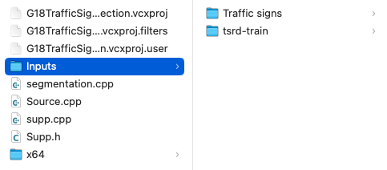
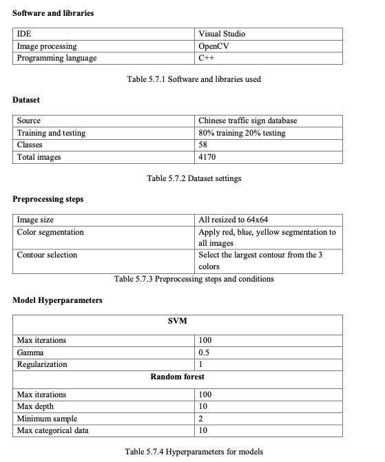
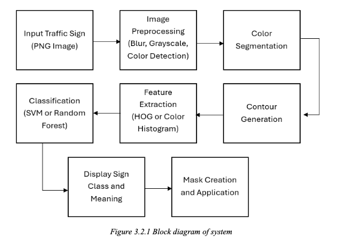
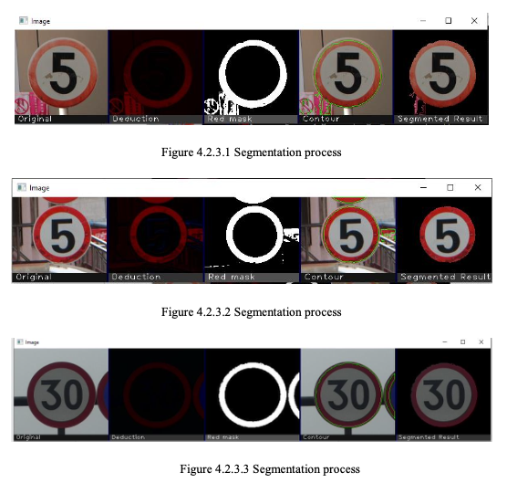

# UCCC-2513 Traffic Sign Recognition System 

A high-performance computer vision project that automatically detects and classifies traffic signs using `OpenCV`, featuring color-based segmentation and machine learning classification with SVM and Random Forest algorithms.

## 📊 Performance Highlights

- **🎯 High Accuracy**: 99.04% training accuracy with SVM, 100% with Random Forest
- **📈 Robust Testing**: 78.57% testing accuracy (SVM) and 82.14% (Random Forest)
- **⚡ Fast Processing**: Under 2 seconds per image classification
- **🎨 Effective Segmentation**: 80%+ accuracy for color-based segmentation
- **📚 Comprehensive Dataset**: Trained on 6,164 clear images from [Chinese Traffic Sign Database](https://nlpr.ia.ac.cn/pal/trafficdata/detection.html) 
- **🔢 Extensive Coverage**: Recognizes 58 different traffic sign types

## ✨ Key Features

- **Multi-Color Segmentation**: Detects traffic signs by isolating red, blue, and yellow regions with 80%+ accuracy
- **Advanced Feature Extraction**: HOG (Histogram of Oriented Gradients) + Color Histogram features
- **Dual Classification Models**: 
  - **SVM**: Linear kernel with 99.04% training accuracy
  - **Random Forest**: Ensemble method with 100% training accuracy
- **Real-time Processing**: Efficient processing under 2 seconds per image
- **Comprehensive Recognition**: 58 traffic sign classes including speed limits, warnings, and directional signs
- **Production Ready**: Tested on 4,170 training images and validated on 1,994 test images (80/20 Train Test Split)

## Requirements

- **OpenCV 4.x** (with contrib modules)
- **C++ Compiler** (GCC, Visual Studio, Clang)

## Installation

### Windows (Visual Studio)
1. Install OpenCV from [opencv.org](https://opencv.org/releases/)
2. Set up OpenCV paths in project properties
3. Compile the project

### Linux/macOS
```bash
# Install OpenCV
sudo apt-get install libopencv-dev  # Ubuntu/Debian
# or
brew install opencv  # macOS

# Compile
g++ -o traffic_sign segmentation.cpp supp.cpp `pkg-config --cflags --libs opencv4`
```

## Usage

### 1. Prepare Your Data

Create the following folder structure:
```
Inputs/
├── Traffic signs/          # Test images for classification
│   ├── Yellow Signs
│   ├── Red signs
│   └── Blue Signs
└── tsrd-train/            # Training images (for model training)
    ├── 001_speed_limit.png
    ├── 002_no_entry.png
    └── ...
```



**Image Naming Convention for Training:**
- Filename should start with 3-digit class number (000-057)
- Example: `001_speed_limit_5kmh.png`, `052_stop_sign.png`

### 2. Run the Program

```bash
./traffic_sign  # Linux/macOS
# or
traffic_sign.exe  # Windows
```

### 3. Choose Operation

The program will display a menu:
```
Please choose number for the following task.
1. Segmentation of traffic sign (HOG + SVM)
2. Segmentation of traffic sign (colorHOG + Random Forest)
3. HOG Extraction and SVM classification model training
4. Color HOG Extraction and Random Forest model training
0. Exit
Enter your choice:
```



## Menu Options Explained

### Option 1: SVM Classification
- Uses pre-trained SVM model (`svm_modelHOG.yml`)
- Processes all images in `Inputs/Traffic signs/`
- Shows original image and segmented result with classification
- **Press any key** to proceed to next image

### Option 2: Random Forest Classification
- Uses pre-trained Random Forest model (`randomForest_modelHOG.yml`)
- Same process as Option 1 but with Random Forest classifier
- Generally provides better accuracy

### Option 3: Train SVM Model
- Extracts HOG features from training images
- Creates `HOGFeatures.csv` with feature data
- Trains SVM classifier and saves to `svm_modelHOG.yml`
- Shows training accuracy and confusion matrix

### Option 4: Train Random Forest Model
- Extracts Color Histogram + HOG features
- Creates `ColorHistogramFeatures.csv`
- Trains Random Forest and saves to `randomForest_modelHOG.yml`
- Displays performance metrics

## Traffic Sign Classes

The system recognizes 58 different traffic sign types:

| Class | Description | Class | Description |
|-------|-------------|-------|-------------|
| 0-7   | Speed limits (5-80 km/h) | 30-31 | Bicycle lane, U-turn |
| 8-17  | Prohibitive signs | 32-51 | Warning signs |
| 18-19 | Additional speed limits | 52-57 | Stop, Give way, etc. |
| 20-29 | Directional signs | | |

## File Descriptions

- **`segmentation.cpp`** / **`Source.cpp`**: Main program with all functionality
- **`supp.cpp`**: Support functions for window management and image processing
- **`Supp.h`**: Header file with function declarations

## How It Works



### 1. Color Segmentation
- Converts image to HSV color space
- Creates masks for red, blue, and yellow regions
- Applies morphological operations to clean up masks



### 2. Contour Detection
- Finds contours in the segmented image
- Selects the largest contour as the traffic sign
- Creates a mask for the detected sign region

### 3. Feature Extraction
- **HOG Features**: Extracts texture and shape information
- **Color Features**: Computes color histograms in HSV space
- Resizes all images to 64x64 for consistency

### 4. Classification
- **SVM**: Linear kernel for binary/multi-class classification
- **Random Forest**: Ensemble method with multiple decision trees
- Returns class number and corresponding sign meaning

## Tips for Best Results

1. **Image Quality**: Use clear, well-lit images
2. **Background**: Signs should be prominent in the image
3. **Training Data**: More training images improve accuracy
4. **Lighting**: Avoid extreme lighting conditions

## Troubleshooting

### Common Issues

**"Error: No images found"**
- Check if `Inputs/Traffic signs/` folder exists
- Verify image files are in PNG format

**"Error: Could not load model"**
- Run training options (3 or 4) first to generate model files
- Ensure model files are in the same directory as executable

**Low accuracy**
- Increase training data size
- Ensure proper image labeling
- Adjust segmentation parameters

### Model Files
After training, these files will be created:
- `svm_modelHOG.yml` - SVM classifier
- `randomForest_modelHOG.yml` - Random Forest classifier
- `HOGFeatures.csv` - Extracted HOG features
- `ColorHistogramFeatures.csv` - Color histogram features

## Example Output

```
Loading SVM model .....SVM model loaded!
Image Class: 52 (Stop)
Inputs/Traffic signs/stop_sign.png

Test Label: 52   Prediction Label: 52
Test Label: 1    Prediction Label: 1
Accuracy: 94.5%
```

## Contributing

1. Fork the repository
2. Add new traffic sign classes to the `getClassMeaning()` function
3. Improve segmentation algorithms
4. Submit pull request

## License

This project is open source. Feel free to use and modify for educational purposes.

---

**Need help?** Open an issue on GitHub or check the troubleshooting section above.
